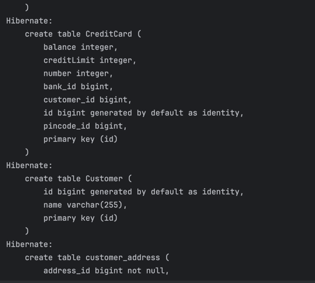
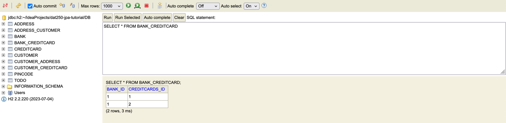

# DAT250 Expass 4 hand-in Andreas Øihaugen

## Technical problems
 - The JPA tutorial test file was written with JUnit 4 and the project as a whole was written with JUnit.jupiter. This was an issue as the tutorial did not work as intended. 
 - The starter code used Collection, but using collection rendered an error in the tests forcing a change to Set.

## Link to code
[Link to Expass4 experiment 2](https://github.com/h598970/dat250-jpa-tutorial)

## Database tables
Firstly I changed the show_sql value to true in the persistence.xml file.
This allowed me to watch the sql commands being sent to the database from persistence.

Secondly I connected to the H2 web console and connected to the database to inspect the contents of the database tables.

